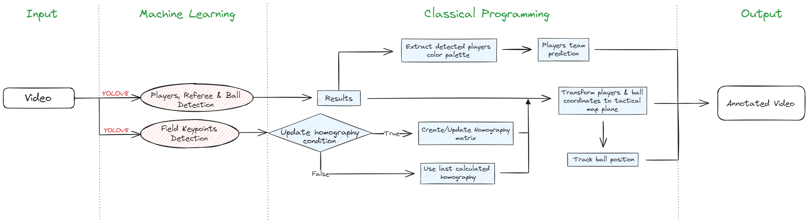

# Football Analytics with Deep Learning and Computer Vision

**Project goal:** Create a web application to automate football analysis, and provide useful information that helps in decision making.

**Current stage:** Developing a streamlit web application for football object detection with tactical map representation.

## Installation & How to use?

Steps:
1. Clone the repository using the command `git clone https://github.com/Majd1029/Football-Analytics-with-Deep-Learning-and-Computer-Vision-master `
2. Install the required libraries listed in the file `requirement.txt`.
3. Use the command `streamlit run main.py` to start the application.
    
## Features

- Detect players, referees and ball.
- Predict players teams based on predefined team colors.
- Build a tactical map representation.
- Track ball movements.

## Application Workflow

The journey of the input video and different functionalities are illustrated in the workflow diagram below.

